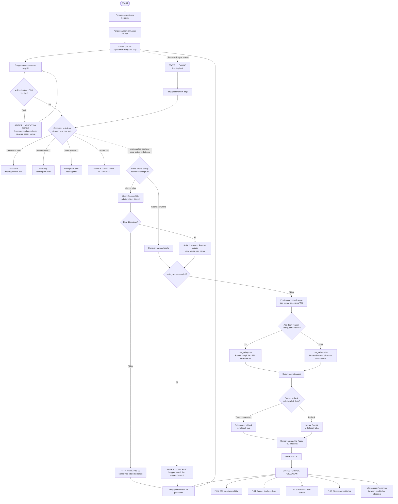

# Flow Prototype Mengacu ke `/docs/flow map.md`

Dokumen flow utama proyek adalah [`../docs/flow map.md`](../docs/flow%20map.md). Pemetaan berikut mengikuti urutan User Act → System/Backend Process → State/UI Output pada dokumen tersebut. Halaman HTML/CSS menyediakan state visual. JavaScript sisi klien hanya mengarahkan tiga nomor resi demo ke fixture masing-masing. Lookup Redis, query database, keputusan status, perhitungan, API, dan pemilihan narasi tetap proses konseptual backend dan tidak dijalankan prototype.

## Pemetaan node sumber ke halaman

| Node pada `/docs/flow map.md` | State atau halaman prototype |
| --- | --- |
| STATE 0: IDLE | `pages/lacak.html` — form kosong dan placeholder |
| Decision 1: format 13 digit untuk tiga fixture demo | Form HTML `required`, `minlength`, `maxlength`, `pattern`; skrip kecil memetakan tiga fixture ke halaman masing-masing |
| STATE E1: VALIDATION ERR | `pages/validation-error.html` — pesan format dan field invalid |
| STATE 1: LOADING | `pages/loading.html` — indikator, skeleton, dan aksi navigasi |
| Redis cache hit / miss | Tahap backend pada flow; tidak ada UI/cache operation di prototype |
| Database tidak menemukan resi / STATE E2 | `pages/not-found.html` — copy 404 ramah dan cara mencoba lagi |
| Database menemukan resi | Data contoh di halaman hasil |
| Decision 4: canceled / STATE E3 | `pages/canceled.html` — indikator merah dan progres berhenti |
| Milestone normal | `pages/tracking-normal.html` — 3 tahap selesai, tahap tujuan menunggu |
| Kondisi operasional delay | `pages/tracking.html` — warning Traffic Jam/Heavy, waiting 45 menit, ETA 18.45 |
| Kondisi operasional clear | `pages/tracking-normal.html` — tanpa banner, ETA standar pukul 18.00 |
| Gemini sukses / `is_fallback=false` | Narasi normal di `pages/tracking-normal.html` |
| Gemini timeout/error / `is_fallback=true` | `pages/ai-fallback.html` — narasi rule-based dan status logistik tetap terlihat |
| HTTP 200: paket tiba | `pages/delivered.html` — semua milestone selesai dan waktu tiba |
| HTTP 500 / layanan gagal | `pages/service-error.html` — pesan gangguan dan jalur kembali |
| Bantuan / selesai | `pages/bantuan.html` dan tautan kembali ke beranda/pencarian |

Beranda (`index.html`) memperkenalkan layanan dan menautkan ke halaman pelacakan; halaman Lacak Kiriman (`pages/lacak.html`) menyediakan form dan tautan demo per status. Halaman hasil juga menghubungkan pencarian, bantuan, dan contoh status lain. Form ringkas pada beranda mengarahkan pengguna ke halaman Lacak Kiriman. Form beranda dan Lacak Kiriman menerima tiga resi demo 13 digit. JavaScript sisi klien memetakan 1000849201994 ke In-Transit, 1000921477821 ke Live Map, dan 1000781293812 ke Peringatan Jalur. Nomor 13 digit lain membuka state tidak ditemukan. Pemetaan tersebut memakai fixture statis dan bukan lookup backend. Halaman loading tetap merupakan contoh layar proses yang dibuka terpisah.

## Batas implementasi HTML/CSS

Flow visual mengikuti seluruh cabang pada dokumen sumber, tetapi cabang Redis, PostgreSQL, status database, Gemini, fallback otomatis, cache TTL, dan respons HTTP hanya direpresentasikan sebagai layar. Skrip klien hanya memetakan tiga nomor resi demo ke fixture yang sudah ditentukan; fitur ini tidak melakukan lookup backend, menyimpan state, menghitung ETA, atau menerima data tracking live.
